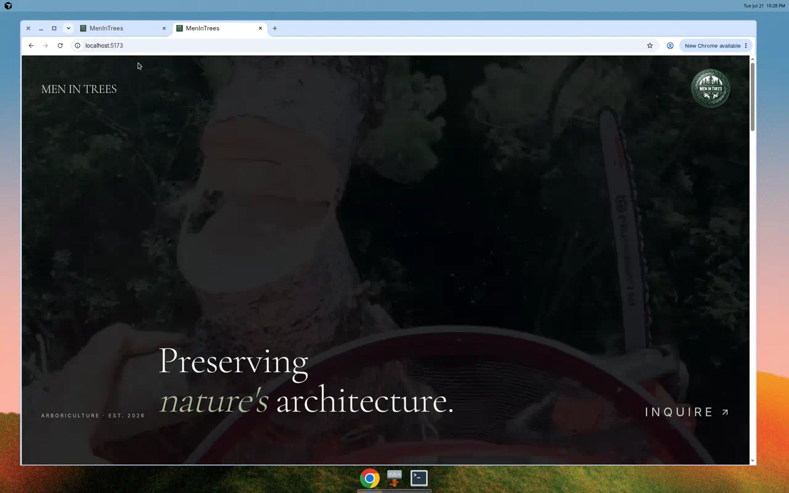
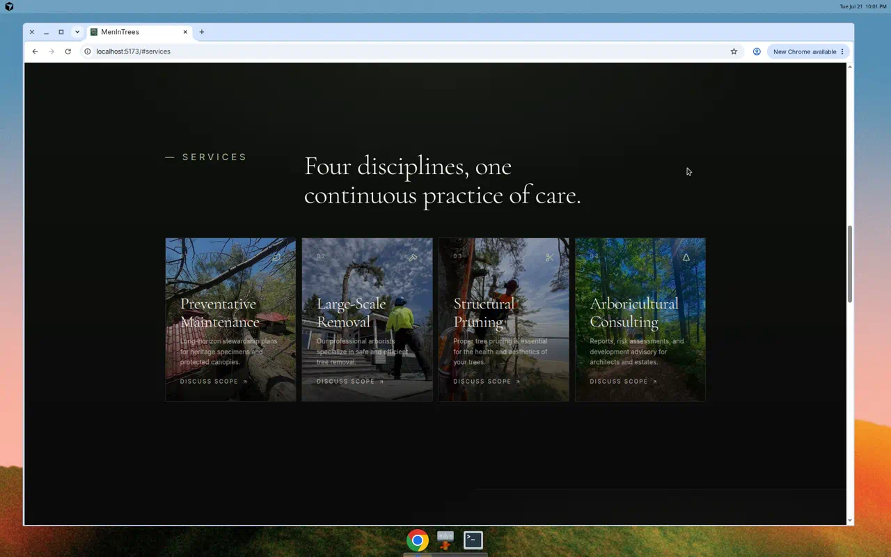
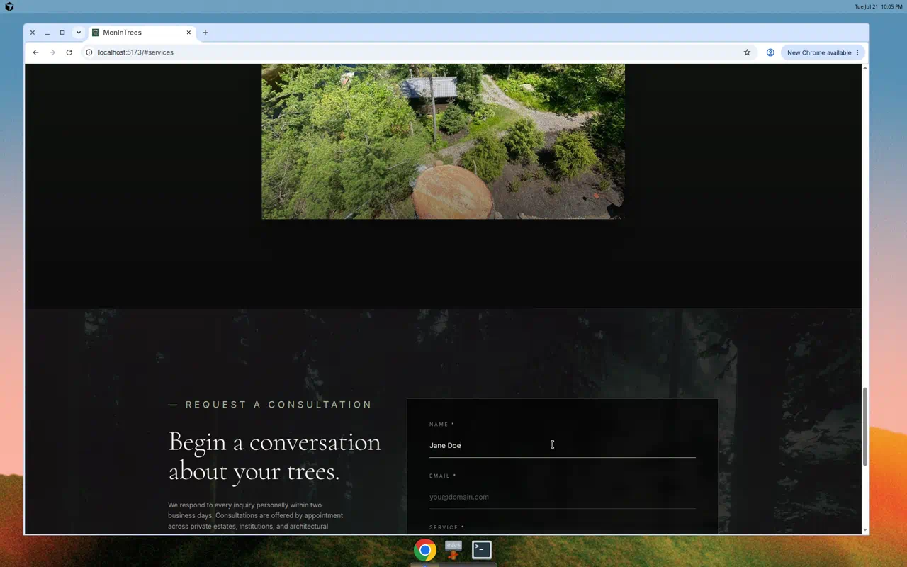
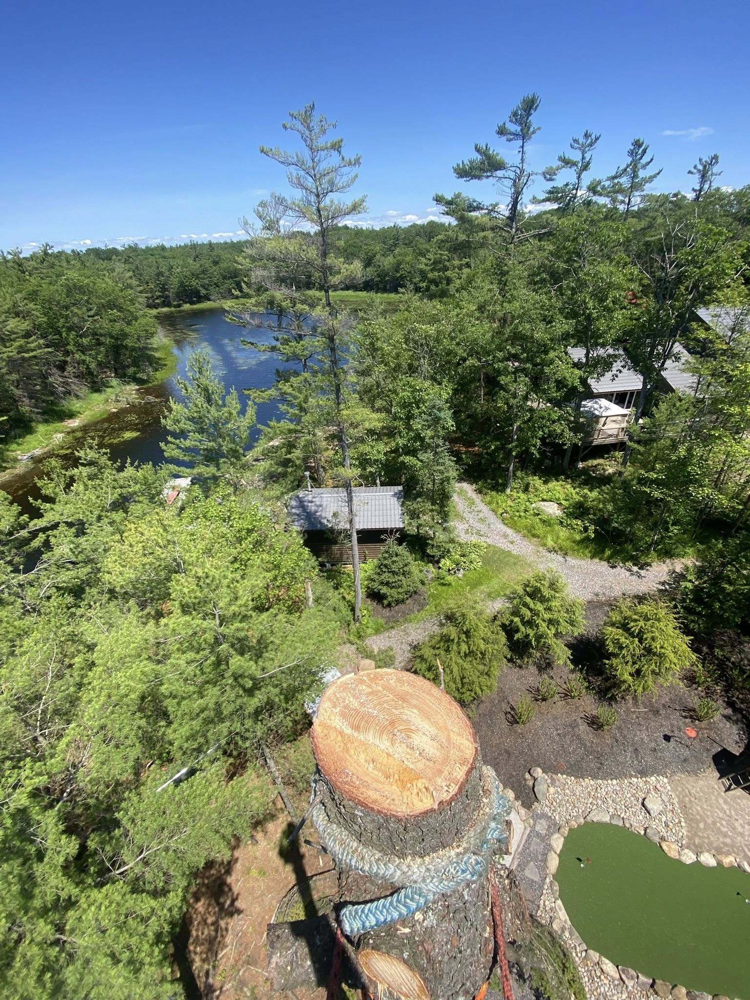
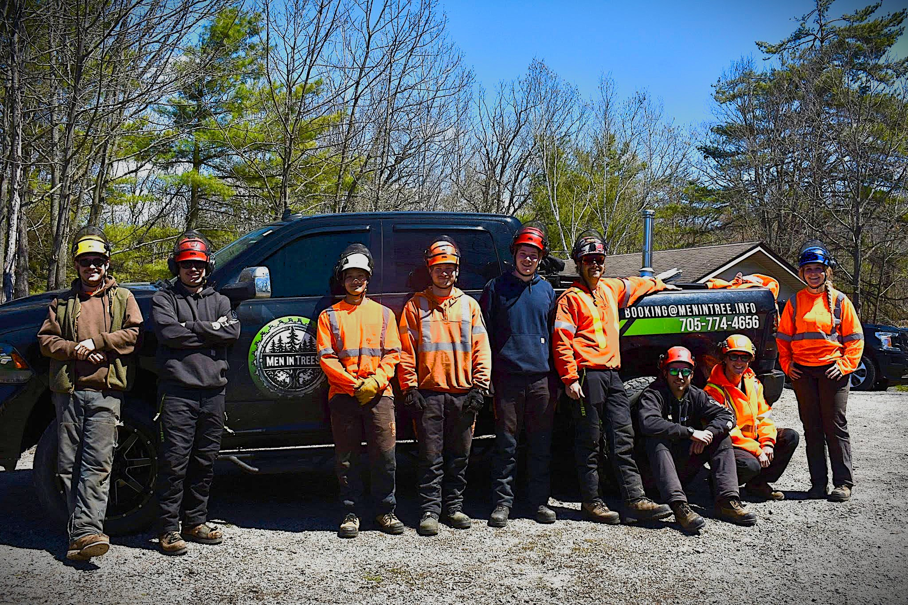
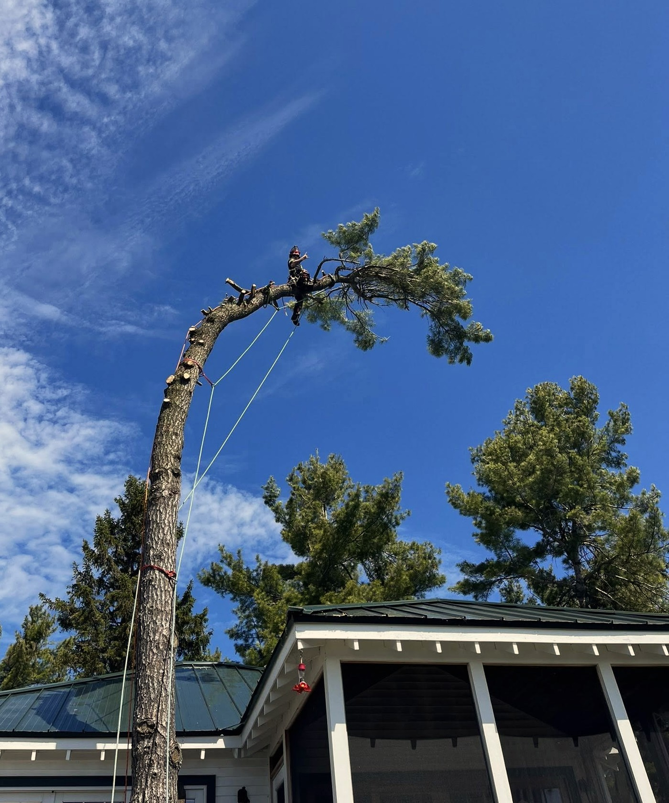
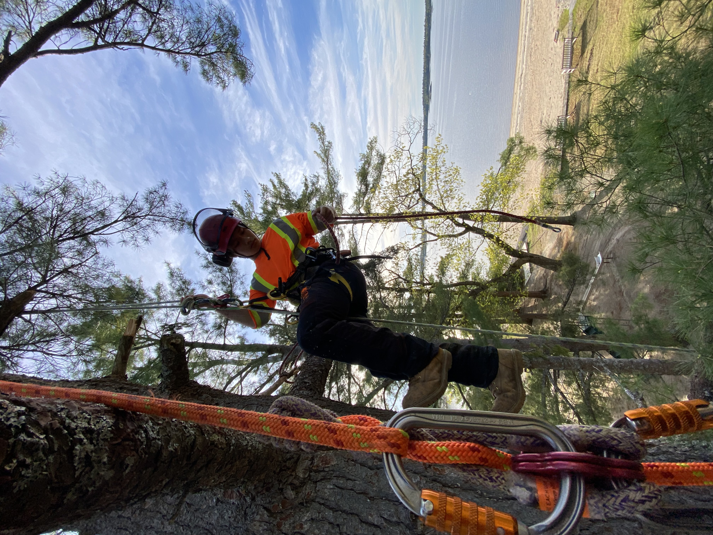
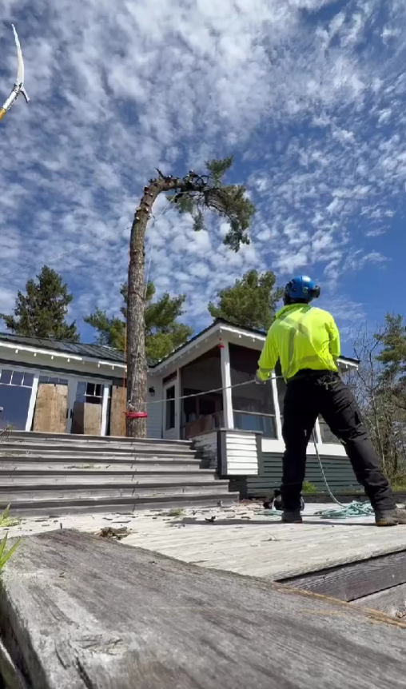
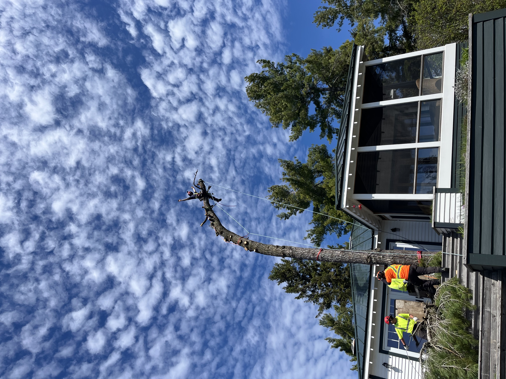
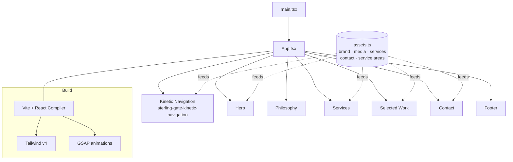

<div align="center">



# 🌲 Men in Trees — Arborist Studio Website

A redesign **case study** and production marketing site for **Men in Trees**, an arborist studio serving **Woods Bay, Georgian Bay & Muskoka, Ontario**. Built as an animated, responsive single-page experience.

[](https://react.dev/)
[](https://www.typescriptlang.org/)
[](https://vite.dev/)
[](https://tailwindcss.com/)
[](https://gsap.com/)

</div>

---

## 📘 Overview

**Men in Trees** is a working arborist studio in the Georgian Bay / Muskoka region offering preventative maintenance, large-scale removal, structural pruning, and arboricultural consulting. This project is the studio's website — reimagined as a modern, cinematic single-page site that reflects the craft and premium positioning of the business.

> **My role:** Founder & front-end developer. I designed and built the site end-to-end — brand direction, layout, animation, and implementation.

**Goals of the redesign**

- Replace a generic template feel with a distinctive, editorial brand experience.
- Make the four core services and portfolio work immediately legible.
- Drive consultation inquiries with a clear, low-friction contact flow.
- Stay fast and responsive on the mobile devices most clients use.

---

## 🎬 Demo

A kinetic navigation overlay, a full-bleed video hero, scroll-driven section reveals, a services grid, a selected-work gallery, and a "Request a Consultation" contact form.

<div align="center">
  
  
</div>

**Real project photography** (from `public/images/`, used on the live site):

<div align="center">
  
  
  
  <br/>
  
  
  
</div>

---

## 🧩 Architecture

A component-driven React SPA. A single [`src/sections/assets.ts`](src/sections/assets.ts) config centralizes all brand content, media paths, services, contact details, and service areas — so copy and imagery can be swapped without touching component logic.



**Stack highlights**

- **React 19 + TypeScript** with the React Compiler enabled (`vite.config.ts`).
- **Tailwind CSS v4** via `@tailwindcss/vite` for styling; **GSAP** for scroll/kinetic animation.
- **lucide-react** icons; `@` path alias → `src/`.
- Content/media abstracted into `assets.ts` for maintainability.

---

## 📁 Folder Structure

```
Menintrees/
├─ index.html
├─ src/
│  ├─ main.tsx                # App entry
│  ├─ App.tsx                 # Composes the page sections + navigation
│  ├─ sections/
│  │  ├─ assets.ts            # 🔧 Central brand/media/content config
│  │  ├─ Hero.tsx             # Full-bleed video hero
│  │  ├─ Philosophy.tsx
│  │  ├─ Services.tsx         # Four core services
│  │  ├─ SelectedWork.tsx     # Portfolio gallery
│  │  ├─ Contact.tsx          # Request-a-consultation form
│  │  └─ Footer.tsx
│  └─ components/ui/          # Kinetic navigation, logo button, shared UI
├─ public/
│  ├─ images/                 # Real project photography used on the site
│  └─ videos/                 # Hero video + poster
├─ docs/assets/               # README screenshots
├─ vite.config.ts
├─ eslint.config.js
└─ package.json
```

---

## 🛠️ How to Run / Install

**Prerequisites:** Node.js 20+ and npm.

```bash
git clone https://github.com/KhaNguyen-Q/Menintrees
cd Menintrees
npm install

npm run dev        # start Vite dev server → http://localhost:5173
npm run lint       # ESLint
npm run build      # type-check + production build to dist/
npm run preview    # preview the production build
```

---

## 💡 Lessons Learned

- **Config-driven content scales.** Centralizing brand copy, media, services, and service areas in `assets.ts` made iterating on the site fast and kept components focused on presentation.
- **Animation needs restraint.** GSAP scroll effects and the kinetic nav add polish, but the priority was keeping the hero and inquiry flow fast and unobtrusive.
- **Performance vs. features.** Enabling the React Compiler and using a local hero poster frame improved perceived load while a large hero video streams in.
- **Design for the client, not the developer.** As founder and builder, the winning decisions were about clarity for prospective clients — legible services and a frictionless consultation request.

---

## 🔭 Future Improvements

- Wire the consultation form to a real backend / email service with validation and spam protection.
- Add a CMS (or MDX) so the studio can edit services and portfolio without code.
- Image optimization pipeline (responsive `srcset`, AVIF/WebP) and lazy-loading for the gallery.
- SEO & local-business schema (Georgian Bay / Muskoka service-area markup) and analytics.
- Accessibility pass (focus states, reduced-motion support for animations).

---

<div align="center"><sub>Men in Trees · Woods Bay · Georgian Bay · Muskoka · Bracebridge · MacTier — React · TypeScript · Vite · Tailwind · GSAP</sub></div>
